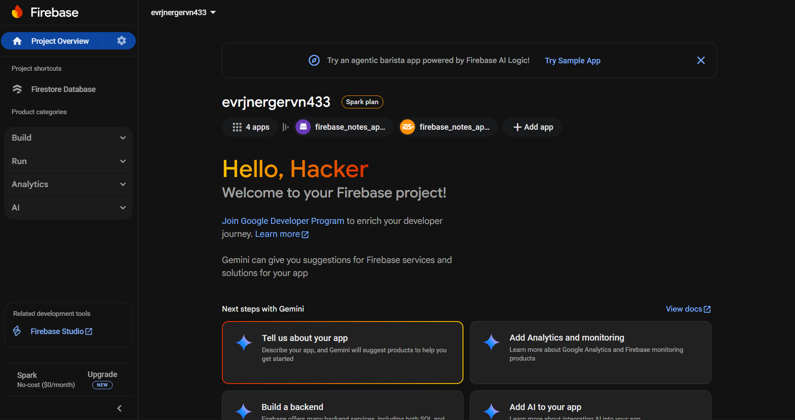
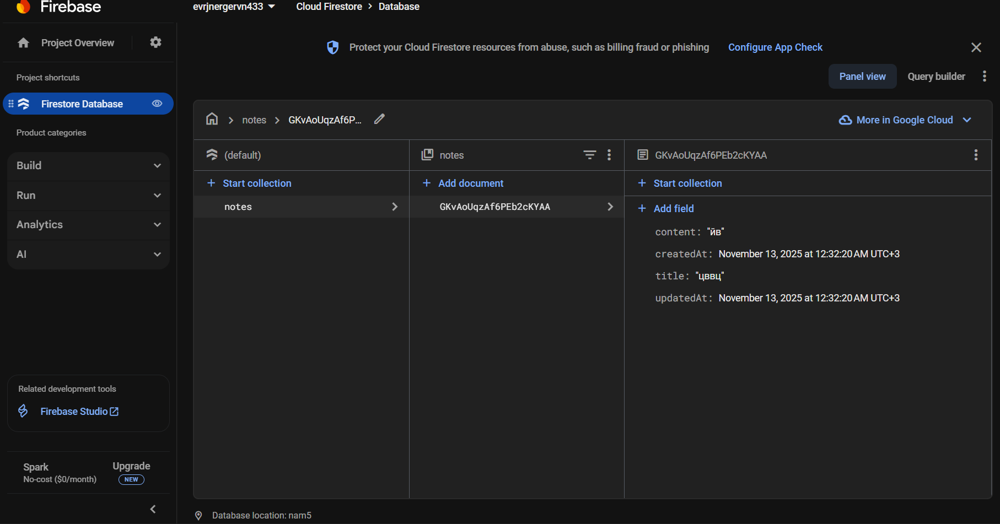

# Практическое занятие №8
**Дисциплина:** Программирование корпоративных систем  
**Институт:** Институт перспективных технологий и индустриального программирования  
**Кафедра:** Кафедра индустриального программирования  
**Преподаватель:** Адышкин Сергей Сергеевич  
**Семестр:** 5 семестр, 2025-2026 гг.  

---

## Тема
Работа с базами данных. Подключение Flutter-приложения к Firebase

---

## Цели занятия
- Подключить Flutter-приложение к Firebase через FlutterFire CLI / вручную.  
- Освоить инициализацию `firebase_core` и работу с `cloud_firestore`.  
- Реализовать CRUD для коллекции данных.  
- Настроить минимальные правила безопасности Firestore для учебной среды.  
- Сформировать практические навыки диагностики и устранения типовых ошибок подключения.

---

## 1. Создание проекта Flutter
Создан новый проект Flutter:

```
flutter create firebase_notes_app
cd firebase_notes_app
flutter run
```
Контрольная точка: проект компилируется и запускается на эмуляторе/устройстве.


2. Создание проекта Firebase и привязка
Проект Firebase создан онлайн через Firebase Console:

Название проекта: my_flutter_notes

Режим тестирования выбран для практики

Приложение Android добавлено: package name com.example.firebase_notes_app

Скачан и помещён google-services.json в android/app/



3. Установка пакетов и инициализация Firebase
В pubspec.yaml добавлены зависимости:

```
dependencies:
  flutter:
    sdk: flutter
  firebase_core: ^3.6.0
  cloud_firestore: ^5.4.4
```
В main.dart произведена инициализация Firebase:

``` 
void main() async {
  WidgetsFlutterBinding.ensureInitialized();
  await Firebase.initializeApp(
    options: DefaultFirebaseOptions.currentPlatform,
  );
  runApp(const MyApp());
}

```


4. Настройка Cloud Firestore
Коллекция: notes

Поля документов:
```
title : string

content : string

createdAt : timestamp

updatedAt : timestamp
```

Правила безопасности (тестовый режим):

```
rules_version = '2';
service cloud.firestore {
  match /databases/{database}/documents {
    match /{document=**} {
      allow read, write: if true;
    }
  }
}
```

Скриншот:



5. Реализация CRUD
Создан экран NotesPage с возможностью:

Создания заметки

Редактирования заметки

Удаления заметки

Автоматического обновления списка через StreamBuilder


6. Безопасность: что поменять в продакшене
Использовать firebase_auth для аутентификации пользователей:

```
await FirebaseAuth.instance.signInAnonymously();
```
Хранить заметки внутри коллекции пользователя:

```
users/{uid}/notes/{noteId}
```
Ограничивать доступ через правила Firestore:

```
allow read, write: if request.auth != null;
```
7. Итоги
Проект Flutter успешно подключен к Firebase

Реализован базовый CRUD для коллекции notes

Применены временные правила безопасности для учебной практики

Все операции проверены через скриншоты

видео работы:

