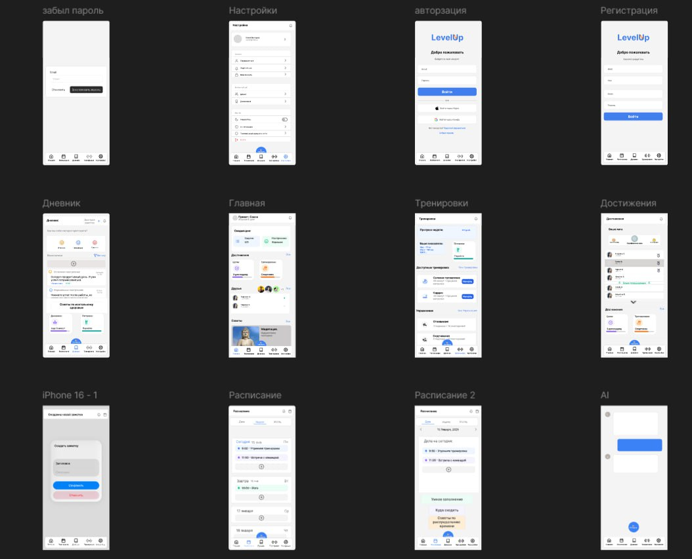
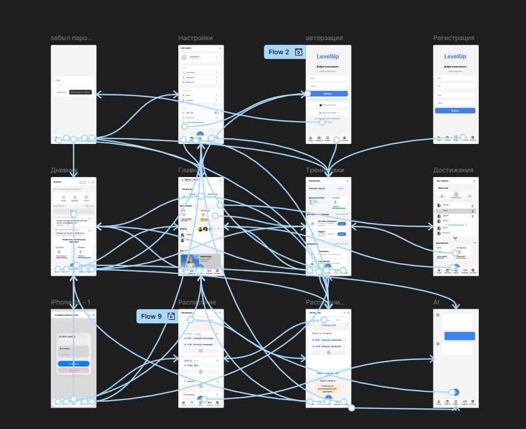
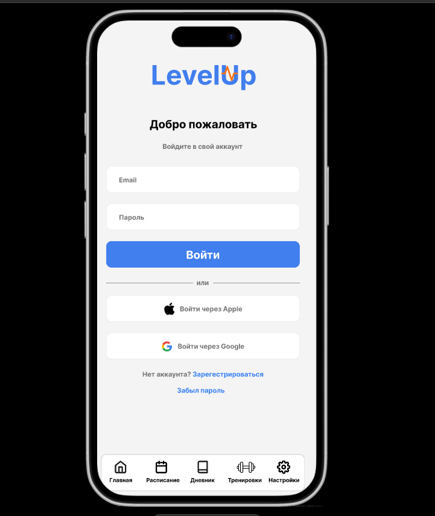
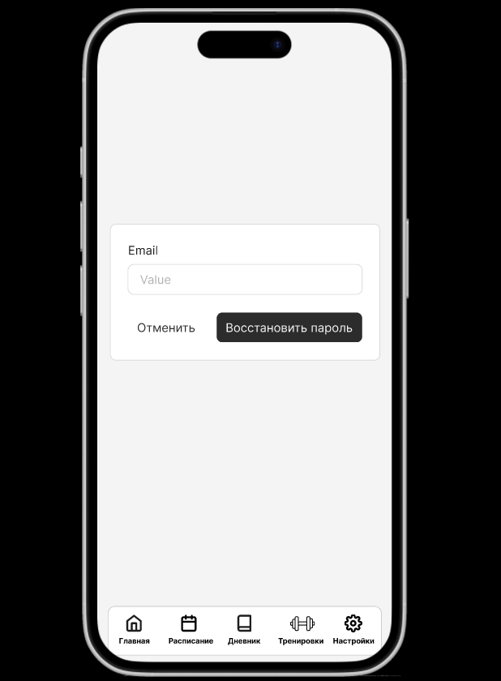
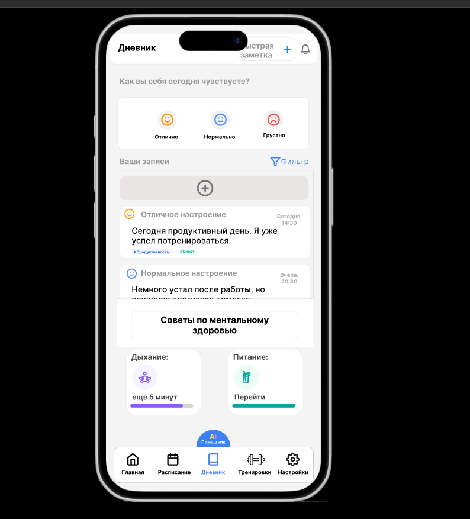
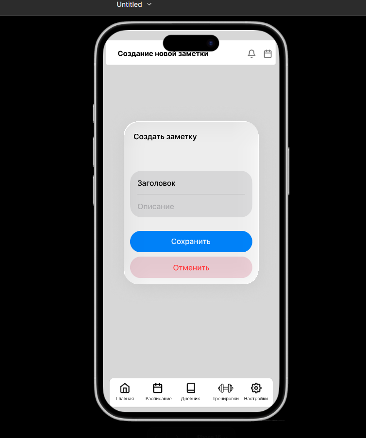

# Отчёт по созданию прототипа мобильного приложения

## 1. Этап Design

На этапе **Design** были созданы основные экраны приложения:

- **Авторизация и регистрация** – для входа и создания аккаунта.  
- **Забыли пароль** – восстановление доступа.  
- **Главная страница** – быстрый доступ к разделам.  
- **Дневник** – записи и заметки пользователя.  
- **Тренировки** – список упражнений и план.  
- **Достижения** – мотивационные цели и прогресс.  
- **Расписание (2 варианта)** – отображение планов по дням.  
- **Настройки** – управление профилем и параметрами.  
- **AI-чат** – для взаимодействия с помощником.  

Использованные элементы интерфейса:
- Поля ввода (логин, пароль, заметки).  
- Кнопки (вход, регистрация, сохранение, редактирование).  
- Навигационное меню снизу (иконки «Главная», «Дневник», «Тренировки», «Достижения», «Настройки»).  
- Карточки с данными (упражнения, задачи, достижения).  
- Переключатели, списки, иконки.  

**Скриншот (Design):**  

---

## 2. Этап Prototype

На этапе **Prototype** экраны были соединены между собой:  

- При нажатии на кнопку «Войти» пользователь переходит на главную страницу.  
- Из меню «Главная» доступен переход в разделы «Дневник», «Тренировки», «Достижения».  
- В настройках можно попасть на экран «Забыли пароль» или «Регистрация».  
- В разделе «Расписание» можно открыть детальную информацию о занятиях.  
- В чате AI пользователь может возвращаться на главную.  

**Скриншот (Prototype):**  

---

## 3. Этап Present

На этапе **Present** был запущен интерактивный прототип:  

- Приложение ведёт себя как готовое – можно «кликать» по кнопкам и переходить между экранами.  
- Проверена логика навигации.  
- Уточнены удобство и читаемость интерфейса.  

**Скриншот (Present):**  

---

## 4. Дополнительные экраны

Для демонстрации были также подготовлены ключевые экраны:  

- **Регестрация**  
  

- **Дневник**  
  

- **Создание заметки**  
  

---

## 5. Краткий анализ

**Что получилось удобно:**  
- Чёткая структура и простая навигация через нижнее меню.  
- Понятные кнопки входа/регистрации.  
- Логичное разделение на экраны (дневник, тренировки, достижения).  
- Использование карточек делает интерфейс современным и наглядным.  

**Что можно улучшить:**  
- Добавить больше визуальных подсказок и иконок в списках.  
- Сделать единый стиль кнопок (некоторые отличаются).  
- В расписании можно улучшить визуализацию (например, календарь вместо списка).  
- Добавить больше элементов геймификации (прогресс-бары, награды).  

---

Ссылка - https://www.figma.com/design/DzbviYsS24B0RgUsUmaMBO/Untitled?node-id=0-1&t=jrt5VnEK2PEbv9TV-1
